# Sistema de Gestión Académica - Árbol Binario de Búsqueda en JAVA

*Estudiante:* Fernando Llerena

*Semestre:* Tercer Semestre  

*Universidad:* Universidad Técnica de Ambato (UTA)  

*Carrera:* Ingeniería de Software  

*Asignatura:* Estructura de Datos  

---


Este proyecto es una implementación de un sistema académico desarrollado para la **Universidad Técnica de Ambato**. El objetivo es gestionar la información de estudiantes utilizando estructuras de datos avanzadas, específicamente **Árboles Binarios de Búsqueda (BST)** en Java.

## 📁 Estructura del Proyecto
A continuación se detalla la organización de los archivos del repositorio, incluyendo la carpeta de evidencias y el código fuente en Java:

```text
PRUEBA-PRACTICA-ARBOLES-CPP-JAVA/
├── evidencias/          # Capturas de pantalla del funcionamiento
│   ├── Insercion1.png
│   ├── insercion2.png
│   ├── insercion3.png
│   ├── insercion4.png
│   ├── insercion5.png
│   ├── opcion2.png
│   ├── ... (hasta opcion14.png)
├── java/                # Código fuente del sistema
│   ├── ArbolBST.java    # Lógica del Árbol Binario de Búsqueda
│   ├── Estudiante.java  # Clase modelo del Estudiante
│   ├── Main.java        # Clase principal con el menú
│   └── Nodo.java        # Estructura del nodo del árbol
└── README.md            # Documentación del proyecto
```

---

## 📋 Descripción del Proyecto
El sistema permite administrar registros de estudiantes (cédula, nombres, apellidos, nota final, carrera y nivel) optimizando las búsquedas y el almacenamiento mediante la lógica de árboles binarios.

### Características Técnicas
- **Lenguaje:** Java 17+
- **Paradigma:** Programación Orientada a Objetos (POO)
- **Estructura de Datos:** Árbol Binario de Búsqueda (ABB / BST)
- **Algoritmos:** Recursividad para inserción y recorridos, y Colas para el recorrido por niveles (BFS).

---

## 🚀 Funcionalidades y Evidencias

### 1. Gestión de Estudiantes (Inserción)
Se permite el registro de nuevos estudiantes manteniendo el orden del árbol por el número de cédula.
<table>
  <tr>
    <td>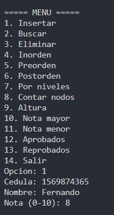</td>
    <td>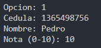</td>
    <td>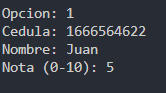</td>
  </tr>
  <tr>
    <td>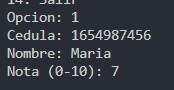</td>
    <td>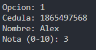</td>
    <td><i>Proceso de registro inicial</i></td>
  </tr>
</table>

### 2. Búsqueda y Eliminación
- **Buscar por Cédula:** Localización eficiente con complejidad O(log n).
- **Eliminar Estudiante:** Reestructuración del árbol manteniendo sus propiedades.

| Operación | Evidencia Visual |
| :--- | :--- |
| **Buscar Estudiante** | 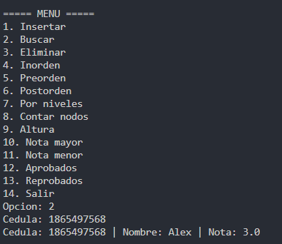 |
| **Eliminar Estudiante** | 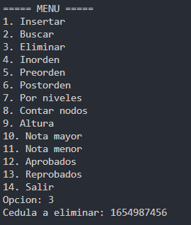 |

### 3. Recorridos del Árbol
Implementación de los algoritmos clásicos de exploración de nodos:
- **Inorden:** 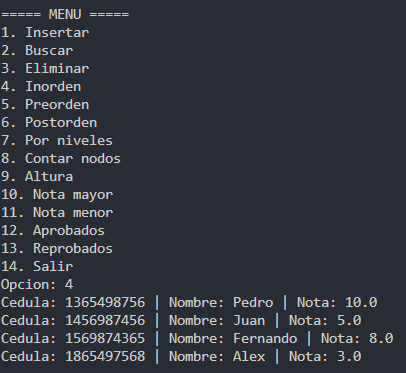
- **Preorden:** 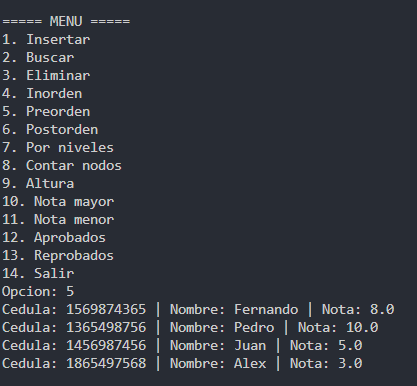
- **Postorden:** 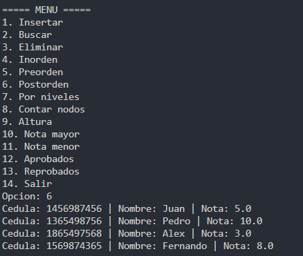
- **Por Niveles (BFS):** 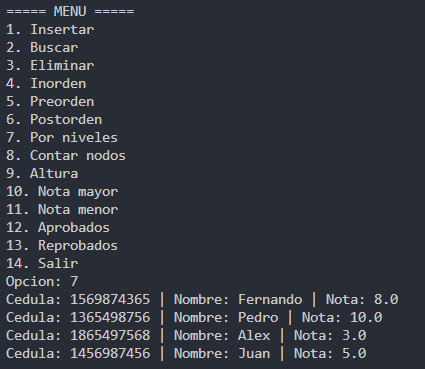

### 4. Estadísticas y Reportes
El sistema genera reportes automáticos basados en la información recolectada:

| Función | Descripción | Evidencia |
| :--- | :--- | :--- |
| **Contar Estudiantes** | Total de nodos en el árbol | 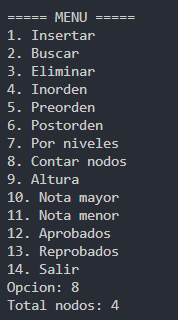 |
| **Altura del Árbol** | Nivel máximo de profundidad | 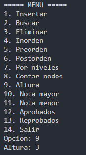 |
| **Nota Mayor** | Estudiante con rendimiento máximo | 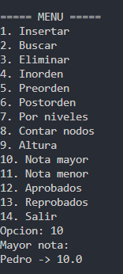 |
| **Nota Menor** | Estudiante con rendimiento mínimo | 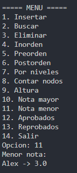 |
| **Aprobados** | Filtro de notas (>= 7.0) | 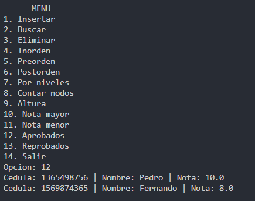 |
| **Reprobados** | Estudiantes con notas inferiores a 7.0 | 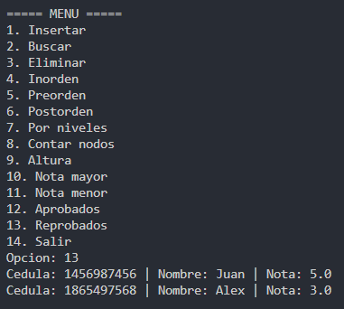 |

### 5. Salida del Sistema
- 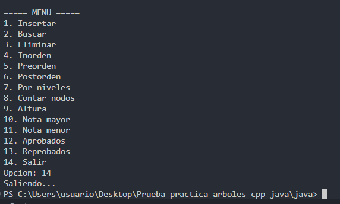

---
